```{r setup, include=FALSE}
library(learnr)

knitr::opts_chunk$set(error = TRUE)
```

## Welcome

Welcome to the QCL Workshop **Data Analysis with R**.

This is a Level 2 workshop, so I will assume you are familiar with the following:

- R and RStudio (4 main panels in RStudio)
- Basic arithmetic with R
- How to install and use R packages
- How to create and use vectors and data frames

Although we will be using many of the packages in the [Tidyverse](https://www.tidyverse.org/), which are usually covered in the **Data Wrangling with R** workshop, I will explain everything we need as we go.

## Before we start

We will use Posit Cloud (previously known as RStudio Cloud). If you don't have an account, create one using your school email by going to https://posit.cloud.

\

```{r fig-posit, echo = FALSE, out.width = "50%", fig.align = "center"}

```

\

Create a **New Project from Git Repository** using the following link https://github.com/CMC-QCL/data_visualization_R. 

```{r fig-project, echo = FALSE, out.width = "50%", fig.align = "center"}
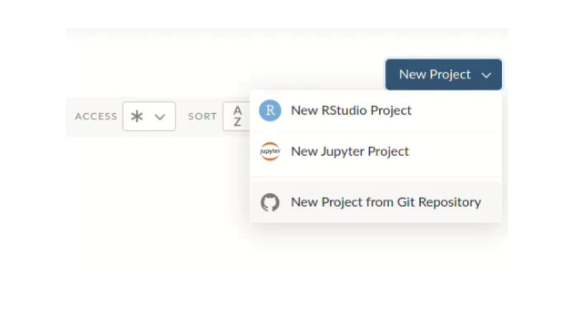
```

```{r fig-project2, echo = FALSE, out.width = "70%", fig.align = "center"}
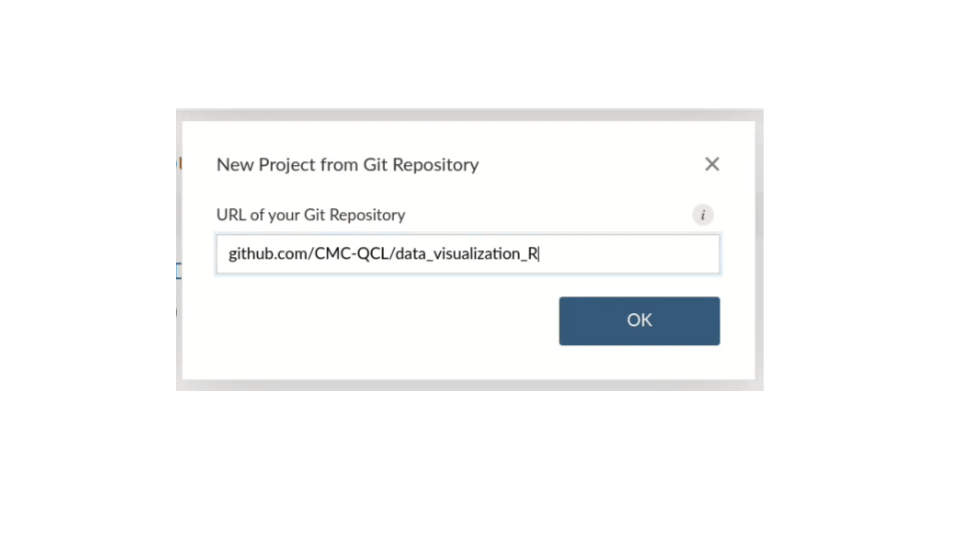
```

Install the packages `tidyverse` and `learnr`. Recall that to install new packages in RStudio you can go to the **Packages** tab in the lower-right panel, click on **Install** and follow the instructions.

```{r fig-packages, echo = FALSE, out.width = "70%", fig.align = "center"}
knitr::include_graphics("images/install_packages.png")
```

```{r fig-packages2, echo = FALSE, out.width = "80%", fig.align = "center"}
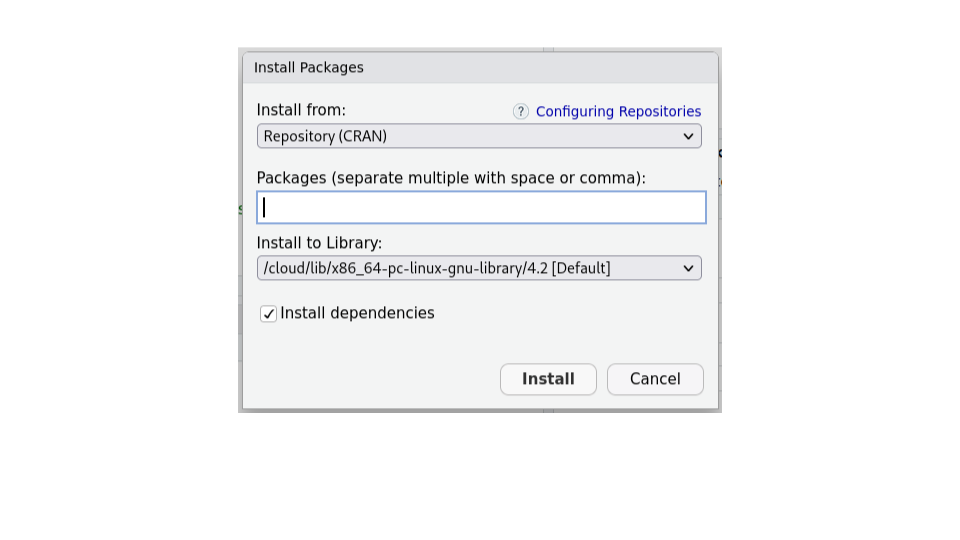
```

## Agenda

* Steps in Data Analysis
* Today's Data
* Plotting Libraries in R
* The Grammar of Graphics
  + The Data Component
  + The Aesthetics Component
  + The Geometries Component
  + The Facets Component
  + The Statistics Component
  + The Coordinates Component
  + The Themes Component

## Steps in Data Analysis

Although many people have different ways of approaching data analysis, it is always a good idea to follow a procedure to help us process our data. The main steps in any data analysis project are the following:

```{r fig-diagram, echo = FALSE, out.width = "100%", fig.align = "center"}
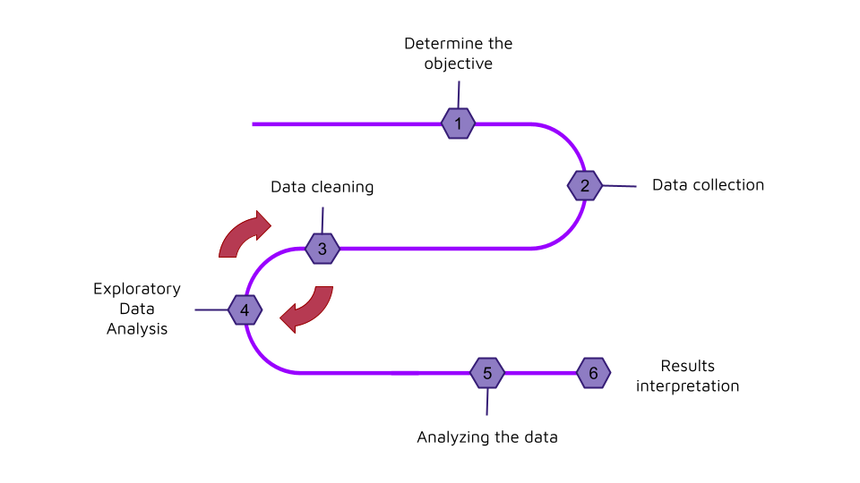
```

In particular, data visualization has two purposes in a data analysis

1. As a tool for exploratory data analysis.
2. To explain and communicate the results.

For today's workshop, suppose we are told to search for patterns in the popularity of movies and TV shows listed in the streaming platforms. We have already collected and cleaned our data. The following step is to explore the data to gain insights.

## Today's Data

The data we will work with today comes from 4 [Kaggle](https://www.kaggle.com/) data sets of movies and TV shows listed in [Netflix](https://www.kaggle.com/datasets/shivamb/netflix-shows), [Amazon Prime](https://www.kaggle.com/datasets/shivamb/amazon-prime-movies-and-tv-shows), [Disney+](https://www.kaggle.com/datasets/shivamb/disney-movies-and-tv-shows) and [Hulu](https://www.kaggle.com/datasets/shivamb/hulu-movies-and-tv-shows), together with their [IMDB information](https://www.imdb.com/interfaces/). You can find the script used for data cleaning on [Github](https://github.com/CMC-QCL/data_visualization_R/blob/main/data_cleaning.R). This is a reduced dataset created for visualization purposes only.

#### **Hands-on 1**

Let's import our data. Use the `read_csv()` function to read the file **streaming\_services.csv** inside the **data/** folder and assign it to the `str_serv` variable.

```{r hands-on1, exercise = TRUE, exercise.eval = FALSE}
library(tidyverse)

# Load the file with today's data
str_serv <- 
```

Take a look at some of the variables in our data

```{r data-head, exercise = TRUE, exercise.eval = FALSE}
# Use the head() function

```

Now explore the structure of the data

```{r data-str, exercise = TRUE, exercise.eval = FALSE}
# Use the str() function

```

## Plotting Libraries in R

```{r fig-libraries, echo = FALSE, out.width = "75%", fig.align = "center"}
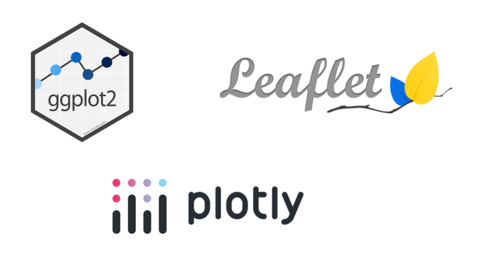
```

There are many useful libraries in R, some of them are:

- [ggplot2](https://ggplot2.tidyverse.org/), part of the tidyverse.
- [Plotly](https://plotly.com/r/), an open source graphing library for interactive plots.
- [Leaflet](https://rstudio.github.io/leaflet/) for R, based on the JavaScript library of the same name used to create interactive maps.
- [Lattice](http://lattice.r-forge.r-project.org/), a data visualization package with an emphasis on multivariate data.

This workshop is organized around `ggplot2`, by far the most popular visualization package in the R environment.

As with other packages from the tidyverse, you can download the cheatsheet to have as reference when working with `ggplot2`. To download it go to https://posit.co/resources/cheatsheets/.

## The Grammar of Graphics

The plotting framework underneath `ggplot2` is based on the principles formalized by Leland Wilkinson in his book The Grammar of Graphics written in 1999, and it allows the user to create graphs by combining independent components.

```{r fig-components, echo = FALSE, out.width = "80%", fig.align = 'center'}
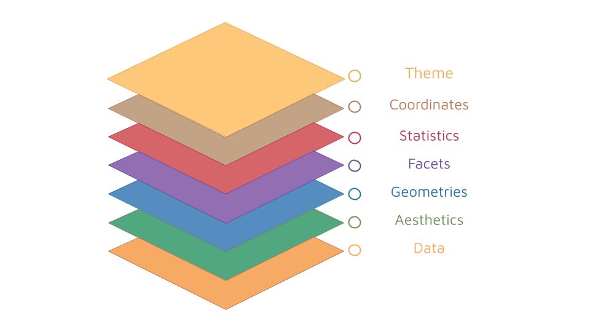
```

The necessary components for any visualization are:
\

```{r tab-essential, echo = FALSE}
# Make table
essential <- data.frame(Element = c("Data", "Aesthetics", "Geometries"),
                    Description = c("The dataset we want to plot", "How we want to map our data", "The visual elements used for our data"))

# Generate table
knitr::kable(essential, "simple")
```

\

## ggplot2 essential components

`ggplot2` works by mapping our **data** to the **aesthetic** attributes (color, shape, size) of **geometric** objects (points, lines, bars)

#### **The Data Component**

All plots start by adding our data using the `ggplot()` function.

```{r data-component, exercise = TRUE, exercise.eval = FALSE}
# Data component
ggplot(str_serv)
```

Notice that this is just a blank space where our plot should be. This is because we have not defined how we want our data to be mapped nor its visual elements.

#### **The Aesthetics Component**

This component maps the variables in our data onto the visual properties of our graph, such as the x and y coordinates. In order to use this component, call the `aes()` function inside `ggplot()`. For example, to plot the average IMDB rating against the release year of the title

```{r aes-component, exercise = TRUE, exercise.eval = FALSE}
# Aesthetic component
ggplot(str_serv, aes(x = startYear, y = averageRating))
```

The `aes()` function has `x` and `y` as positional arguments, so you can write the same thing as above without naming them

```{r aes-component2, exercise = TRUE, exercise.eval = FALSE}
# Aesthetic component
ggplot(str_serv, aes(startYear, averageRating))
```

Still you won't be able to see your data, but we now have our x-axis and y-axis.

#### **The Geometries Component**

There are multiple `geom_*` functions in `ggplot2` we can use to represent our data. If we want a simple scatter plot, we can use the `geom_point()` function. Let's try it

```{r geom-component, exercise = TRUE, exercise.eval = FALSE}
# Geometric component
ggplot(str_serv, aes(startYear, averageRating)) + 
  geom_point()
```

Notice that this time, we added the geometric component using `+`. In `ggplot2` we can use the `+` sign to add new layers to our plot, similar to how use the pipe operator `%>%` to add new steps in our data wrangling. You can also use this to modify the same plot in different ways. For example:

```{r stack-layer, exercise = TRUE, exercise.eval = FALSE}
# Make an R object
p <- ggplot(str_serv, aes(startYear, averageRating))

# Add the geometric layer
p + geom_point()
```


#### **Hands-on 2**

Complete the following code to create a scatter plot of the budget vs. the revenue

```{r hands-on2, exercise = TRUE, exercise.eval = FALSE}
# Plot budget (y) vs. revenue (x)
ggplot(str_serv)
```


## Other aesthetic attributes

You can add additional variables to a plot using other aesthetics like color, shape and size.

```{r add-color, exercise = TRUE, exercise.eval = FALSE}
# Color by platform
str_serv %>% 
  ggplot(aes(revenue, budget, color = platform)) + 
  geom_point()
```

You can also add the aesthetic attributes using the geom function

```{r geom-aes, exercise = TRUE, exercise.eval = FALSE}
# Color by platform in geom_point()
str_serv %>% 
  ggplot(aes(revenue, budget)) + 
  geom_point(aes(color = platform))
```

Suppose you want to color all the points with a fixed color, you can do so using the color name outside of `aes()`

```{r fixed-color, exercise = TRUE, exercise.eval = FALSE}
# Fixed color scatter plot
str_serv %>% 
  ggplot(aes(revenue, budget)) + 
  geom_point(color = "purple")
```

#### **Hands-on 3**

Make a scatter plot, this time coloring by country

```{r hands-on3, exercise = TRUE, exercise.eval = FALSE}
# Color by country
str_serv
```

Note from this plot that there are some NA values there. We can take care of them by tidying up the data before plotting it

```{r hands-on3-fix, exercise = TRUE, exercise.eval = FALSE}
# Color by country without NAs
str_serv %>% 
  filter(!is.na(country)) %>%
  ggplot(aes(revenue, budget, color = country)) + 
  geom_point()
```

#### **Hands-on 4**

Now try the other aesthetic attributes: shape and size. First, make a base plot

```{r hands-on41, exercise = TRUE, exercise.eval = FALSE}
# Make a base plot 'p' with just the data component


```

Use the base plot to make a graph of budget vs. revenue with the shape determined by the platform

```{r hands-on42, exercise = TRUE, exercise.eval = FALSE}
# Shape by platform


```

Use the same base plot to make the same graph, this time with the size determined by the average rating

```{r hands-on43, exercise = TRUE, exercise.eval = FALSE}
# Size by averageRating


```

## Common `geom_*` functions

Now we will explore some of the most popular `geom_*` functions. 

#### **Bar plots**

To make a histogram you can use the `geom_col()` function. Let's make a bar plot of the totals of every genre. There is some data wrangling involved, so I went ahead and did that for you. The dataset we need is in the **counts\_by\_genre.csv** file inside the **data/** folder

```{r col, exercise = TRUE, exercise.eval = FALSE}
# Read the new file
cbg <- 

# Bar plot by totals of genres
cbg %>%
  ggplot(aes(genre, total)) +
  geom_col()
```

#### **Box plots**

To make a box plot you can use the `geom_boxplot()` function. Let's make some box plots of the average IMDB rating for each of the platforms

```{r box, exercise = TRUE, exercise.eval = FALSE}
# Box plot of rating by platforms
str_serv %>%
  ggplot(aes(platform, averageRating)) +
  geom_boxplot()
```

#### **Hands-on 5**

Now it's your turn to create box plots of the average rating , this time for the different types of media

```{r hands-on5, exercise = TRUE, exercise.eval = FALSE}
# Box plots of budget by type of media


```

## Resources

Some useful online resources to keep learning about `ggplot2` are:

- [Statistical tools for hight-throughput data analysis](http://www.sthda.com/english/wiki/ggplot2-essentials)
- The guide on R by the [Attention and Working Memory Lab at Georgia Tech](https://englelab.gatech.edu/useRguide/introduction-to-ggplot2.html)

If you are looking for datasets, these are some good resources:

- [Reddit **r/datasets**](https://www.reddit.com/r/datasets/)
- [Kaggle datasets](https://www.kaggle.com/datasets)

You can practice your visualization skills too by reproducing other plots. You can find some beautiful ones on:

- [Reddit **r/dataisbeautiful**](https://www.reddit.com/r/dataisbeautiful/)
- [the R Graph Gallery](https://r-graph-gallery.com)

## How to download your project

You can download your project and run this tutorial on your own computer. First you need to go to your workspace.

```{r fig-workspace, echo = FALSE, out.width = "90%", fig.align = "center"}
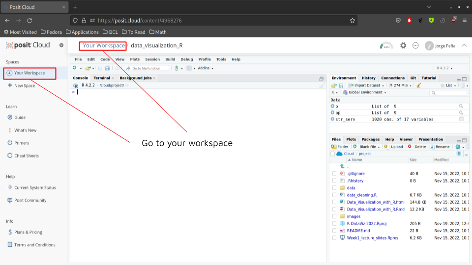
```

Once in your workspace, click on the export button.

```{r fig-export1, echo = FALSE, out.width = "90%", fig.align = "center"}
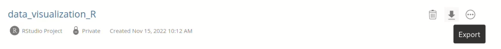
```

This will create a zip file with all the files inside your project. It may take a while.

```{r fig-export2, echo = FALSE, out.width = "80%", fig.align = "center"}
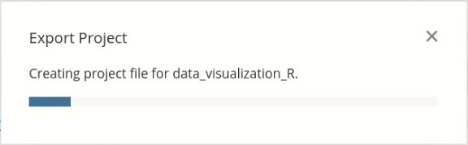
```

```{r fig-export3, echo = FALSE, out.width = "80%", fig.align = "center"}
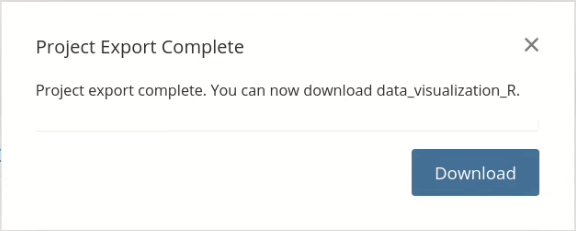
```

When the export is complete you will be able to download the zip file to your computer.

```{r fig-dest, echo = FALSE, out.width = "90%", fig.align = "center"}
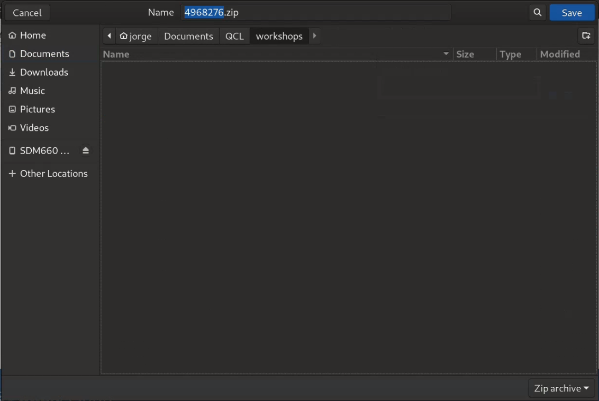
```


