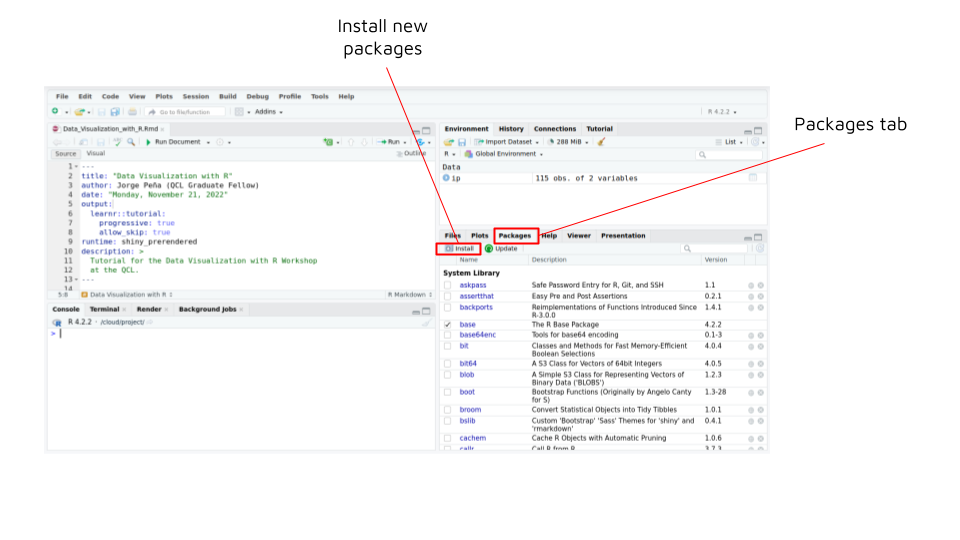
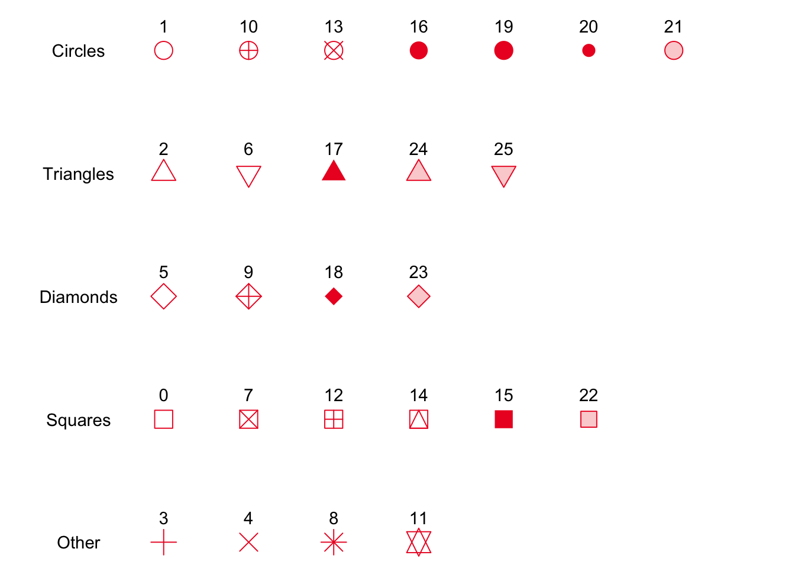
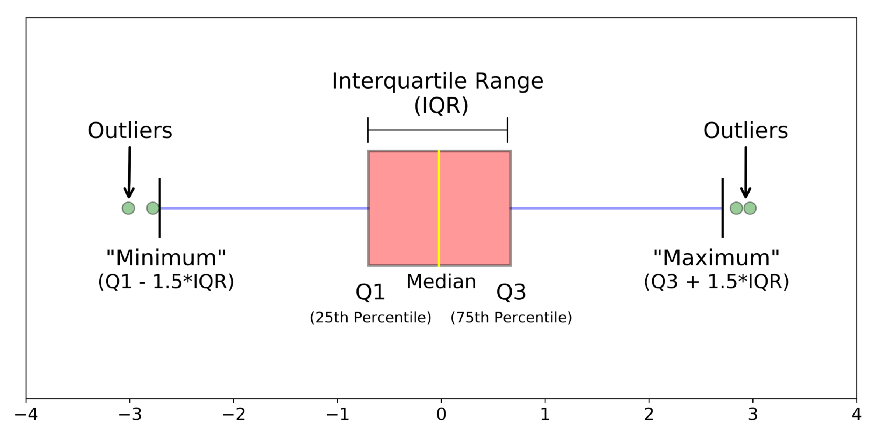

```{r setup, include=FALSE}
knitr::opts_chunk$set(error = TRUE)
```

## Welcome

Welcome to the QCL Workshop **Data Analysis with R**.

This is a Level 2 workshop, so I will assume you are familiar with the following:

- R and RStudio (4 main panels in RStudio)
- Basic arithmetic with R
- How to install and use R packages
- How to create and use vectors and data frames

## Before we start

We will use Posit Cloud (previously known as RStudio Cloud). If you don't have an account, create one using your school email by going to https://posit.cloud.

\

```{r fig-posit, echo = FALSE, out.width = "50%", fig.align = "center"}
knitr::include_graphics("images/posit_logo.png")
```

\

Create a **New Project from Git Repository** using the following link https://github.com/CMC-QCL/data_visualization_R. 

```{r fig-project, echo = FALSE, out.width = "50%", fig.align = "center"}

```

```{r fig-project2, echo = FALSE, out.width = "70%", fig.align = "center"}

```

Install the packages `tidyverse` and `learnr`. Recall that to install new packages in RStudio you can go to the **Packages** tab in the lower-right panel, click on **Install** and follow the instructions.

```{r fig-packages, echo = FALSE, out.width = "70%", fig.align = "center"}

```

```{r fig-packages2, echo = FALSE, out.width = "80%", fig.align = "center"}
knitr::include_graphics("images/install_packages2.png")
```

## Agenda

* Steps in Data Analysis
* Today's Data
* Plotting Libraries in R
* The Grammar of Graphics
* ggplot2 Essential Components
  + The Data Component
  + The Aesthetics Component
  + The Geometries Component
* Other Components (if time permits)
* Digital Badge
* Resources
* Save Your Project

## Steps in Data Analysis

It is always a good idea to follow a procedure to help us process our data. These are some of the steps you can follow on a data analysis project:

```{r fig-diagram, echo = FALSE, out.width = "100%", fig.align = "center"}
knitr::include_graphics("images/data_analysis.png")
```

In particular, data visualization has two purposes in a data analysis project

1. As a tool for exploratory data analysis.
2. To explain and communicate the results.

For today's workshop, suppose we are told to search for patterns in the popularity of movies and TV shows listed in the streaming platforms. We have already collected and cleaned our data. The following step is to explore the data to gain insights.

## Today's Data

The data we will work with today comes from 4 [Kaggle](https://www.kaggle.com/) data sets of movies and TV shows listed in [Netflix](https://www.kaggle.com/datasets/shivamb/netflix-shows), [Amazon Prime](https://www.kaggle.com/datasets/shivamb/amazon-prime-movies-and-tv-shows), [Disney+](https://www.kaggle.com/datasets/shivamb/disney-movies-and-tv-shows) and [Hulu](https://www.kaggle.com/datasets/shivamb/hulu-movies-and-tv-shows), together with their [IMDB information](https://www.imdb.com/interfaces/). You can find the script used for data cleaning on [Github](https://github.com/CMC-QCL/data_visualization_R/blob/main/data_cleaning.R). This is a reduced dataset created for visualization purposes only.

#### **Hands-on 1**

Let's import our data. Use the `read_csv()` function to read the file **streaming\_services.csv** inside the **data/** folder and assign it to the `str_serv` variable.

```{r hands-on1}
library(tidyverse)

# Load the file with today's data

```

Take a look at some of the variables in our data

```{r data-head, include = TRUE, echo = TRUE}
# Use the head() function

```

Now explore the structure of the data

```{r data-str}
# Use the str() function

```

## Plotting Libraries in R

```{r fig-libraries, echo = FALSE, out.width = "75%", fig.align = "center"}

```

There are many useful libraries in R, some of them are:

- [ggplot2](https://ggplot2.tidyverse.org/), part of the tidyverse.
- [Plotly](https://plotly.com/r/), an open source graphing library for interactive plots.
- [Leaflet](https://rstudio.github.io/leaflet/) for R, based on the JavaScript library of the same name used to create interactive maps.
- [Lattice](http://lattice.r-forge.r-project.org/), a data visualization package with an emphasis on multivariate data.

This workshop is organized around `ggplot2`, by far the most popular visualization package in the R environment.

As with other packages from the tidyverse, you can download the cheatsheet to have as reference when working with `ggplot2`. To download it go to https://posit.co/resources/cheatsheets/.

## The Grammar of Graphics

The plotting framework underneath `ggplot2` is based on the principles formalized by Leland Wilkinson in his book The Grammar of Graphics written in 1999, and it allows the user to create graphs by combining independent components.

```{r fig-components, echo = FALSE, out.width = "80%", fig.align = 'center'}
knitr::include_graphics("images/layers.png")
```

The necessary components for any visualization are:
\

```{r tab-essential, echo = FALSE}
# Make table
essential <- data.frame(Element = c("Data", "Aesthetics", "Geometries"),
                    Description = c("The dataset we want to plot", "How we want to map our data", "The visual elements used for our data"))

# Generate table
knitr::kable(essential, "simple")
```

\

## ggplot2 Essential Components

`ggplot2` works by mapping our **data** to the **aesthetic** attributes (color, shape, size) of **geometric** objects (points, lines, bars)

### The Data Component

All plots start by adding our data using the `ggplot()` function.

```{r data-component}
# Data component

```

Notice that this is just a blank space where our plot should be. This is because we have not defined how we want our data to be mapped nor its visual elements.

### The Aesthetics Component

This component **maps** the variables in our data onto the visual properties of our graph, such as the x and y coordinates. In order to use this component, call the `aes()` function. For example, to plot the average IMDB rating (`averageRating`) against the release year of the title (`startYear`)

```{r aes-component}
# Aesthetic component

```

Notice that this time, we added the geometric component using `+`. In `ggplot2` we can use the `+` sign to add new layers to our plot, similar to how we use the pipe operator `%>%` to add new steps in our data wrangling.

The `aes()` function has `x` and `y` as positional arguments, so you can write the same thing as above without naming them

```{r aes-component2}
# Aesthetic component

```

Still you won't be able to see your data, but we now have our x-axis and y-axis.

### The Geometries Component

There are multiple `geom_*` functions in `ggplot2` we can use to represent our data. If we want a simple scatter plot, we can use the `geom_point()` function. Let's try it

```{r geom-component}
# Geometric component

```


#### **Hands-on 2**

Create a scatter plot of budget vs. revenue

```{r hands-on2}
# Plot budget (y) vs. revenue (x)

```


### Other Aesthetic Mappings

You can add additional variables to a plot using other aesthetics like color, shape and size.

```{r add-color}
# Color by platform

```

### Aesthetics vs. Attributes

Aesthetics, in `ggplot2`, refer to which variable is mapped onto it, while attributes refer to how something looks. Aesthetic mappings are defined inside the `aes()` function, while attributes are defined outside.

Suppose you want to color all the points with a fixed color, you can do so using the color argument inside `geom_point()`.

```{r fixed-color}
# Fixed color scatter plot

```

#### **Hands-on 3**

Now try the other aesthetic mappings: shape and size. Make a scatter plot of budget vs. revenue with the shape determined by the platform

```{r hands-on31}
# Scatter plot with shape determined by platform


```

Note that the shape mapping takes discrete variables.

```{r fig-shapes, echo = FALSE, out.width = "100%", fig.align = "center"}

```

Make the same scatter plot, this time with the size determined by the average rating

```{r hands-on32}
# Scatter plot with size determined by averageRating

```

Note that continuous and discrete variables can be mapped onto the size aesthetic.

Use our previous plot to set the alpha attribute to 0.5. See the difference.

```{r hands-on33}
# Scatter plot with size determined by averageRating with transparency

```

### Multiple geometric layers

It is sometimes useful to combine multiple geometric layers. For example, to draw a straight line between two groups of points in your scatter plot or draw a dot to represent the mean value of your data.

Let's use our scatter plot of budget vs revenue colored by platform as our base plot

```{r multiple-base}
# Base plot

```

To draw a horizontal line we can use the `geom_hline()` function by specifying the y-intercept

```{r multiple-hline}
# Draw a horizontal line

```

We can use the `linetype` and `color` arguments to modify the plotted line. The possible arguments for `linetype` are: **"twodash", "solid", "longdash", "dotted", "dotdash", "dashed"** and **"blank"**.

Similarly, we can use `geom_vline()` to draw vertical lines by specifying the x-intercept

```{r multiple-vline}
# Draw a vertical line

```

To draw diagonal lines, use the `geom_abline()` function by specifying the y-intercept and slope of the line

```{r multiple-abline}
# Draw a diagonal line

```

#### Global vs Local Aesthetic Mappings

In our previous plots, all geometric layers have inherited the aesthetic mappings we defined on our `ggplot()` function. This is called the **global mapping**. However, we can also define our aesthetic mappings inside the `geom_*` functions. These are called **local mappings**.

We can use local mappings to modify our aesthetics for each of the geometric layers. For example, if we want to draw a point on our scatter plot representing the mean value of our data we can add a second geometric layer with a different aesthetic mapping

```{r big-red}
# Compute the mean of our data


# Plot the big red point in our scatter plot


```

We can also create different plots using the same global mapping and adding additional mappings in each geometric layer

```{r global-aes}
# Make a base plot 'p' for the budget vs. revenue plot


```

Use the base plot to make a graph of budget vs. revenue with the shape determined by the platform

```{r local-aes-shape}
# Shape by platform


```

Use the same base plot to make the same graph, this time with the size determined by the average rating

```{r local-aes-size}
# Size by averageRating


```

### Common `geom_*` functions

Now we will explore some of the most popular `geom_*` functions. 

#### Bar Plots

To make a bar plot you can use the `geom_col()` and `geom_bar()` functions. `geom_col()` takes the heights of the bars to represent the values in the data.

Let's make a bar plot of the totals of every genre.

```{r fig-genre-bar, echo = FALSE, out.width = "100%", fig.align = "center"}

```

There is some data wrangling involved, so I went ahead and did that for you. The dataset we need is in the **counts\_by\_genre.csv** file inside the **data/** folder. Take a look at the data first

```{r col-data}
# Read the new file

```
  
Now, use `geom_col()` to make the bar plot

```{r col-plot}
# Bar plot by totals of genres

```

On the other hand, `geom_bar()` makes the heights of the bars to be the number of cases in each distinct value. Suppose we want to make the following bar plot of the counts of movies and TV shows in each platform.

```{r fig-platform-bar, echo = FALSE, out.width = "100%", fig.align = "center"}

```

```{r bar-plot}
# Bar plot of platform count

  
```

#### Box Plots

```{r fig-boxplot, echo = FALSE, out.width = "100%", fig.align = "center"}

```

To make a box plot you can use the `geom_boxplot()` function. Let's make some box plots of the average IMDB rating (`averageRating`) for each of the platforms

```{r box}
# Box plot of rating by platforms

```

#### **Hands-on 4**

Now it's your turn to create box plots of the average rating , this time for the different types of media

```{r hands-on4}
# Box plots of budget by type of media


```

## Other Components

Defining the rest of the components is not essential for the plot, but they allow you to add and modify elements of your plot that you may find helpful to explore or communicate your data. These components are:

```{r tab-extra, echo = FALSE}
# Make table
extra <- data.frame(Element = c("Facets", "Statistics", "Coordinates", "Themes"),
                    Description = c("Panels of multiple plots", "Statistical summaries calculated from the data", "The coordinates system", "All non-data elements of your plot"))

# Generate table
knitr::kable(extra, "simple")
```

### The Facets Component

Faceting generates multiple plots showing different subsets of the data. This is particularly useful during the EDA to compare patterns in different parts of the data. 

Suppose you want to create multiple scatter plots of budget vs. revenue, one for each platform

```{r facet-platform}
# Facets of budget vs. revenue
str_serv %>%
  ggplot(aes(revenue, budget)) +
  geom_point() +
  facet_wrap(~ platform)
```


### The Statistics Component

This component adds computed values to your plot to help you see patterns in your data. For example, suppose you want to add a linear regression line to your scatter plot of budget vs. revenue

```{r stat-lm}
# Linear regression line
str_serv %>%
  ggplot(aes(revenue, budget)) +
  geom_point() +
  stat_smooth(method = "lm")
```

### The Coordinates Component

This component controls the x and y coordinates in your plot. Take the scatter plot of budget vs. revenue colored by platform we made earlier.

```{r prev-scatter}
# Take a look at the scatter plot we made earlier
str_serv %>%
  ggplot(aes(revenue, budget, color = platform)) +
  geom_point()
```

Most of the points are concentrated near the origin, so finding patterns there might be difficult. One thing we can try to do is to limit the x-axis to a certain range of values in order to take a closer look. 

```{r coord-xlim}
# Set a limit for the x-axis
str_serv %>%
  ggplot(aes(revenue, budget, color = platform)) +
  geom_point() +
  coord_cartesian(xlim = c(0, 1.5e+08))

```

Another approach could be changing the scale in the x-axis. By using a logarithmic scale, it is easier to visualize smaller values in a graph otherwise dominated by larger values.

```{r coord-trans}
# Use a logarithmic scale on the x-axis
str_serv %>%
  ggplot(aes(revenue, budget, color = platform)) +
  geom_point() +
  coord_trans(x = "log10")

```


### The Themes Component

Some of the things you can do with the themes component is to change the labels and ticks of x and y-axis and modify the plot legends titles.

As an example, let's add a title to the scatter plot of budget vs. revenue colored by platform.

```{r theme-title}
# Add a title to the plot
str_serv %>%
  ggplot(aes(revenue, budget, color = platform)) +
  geom_point() +
  labs(title = "Budget vs. Revenue by platform")
```

Now, we can use the `theme()` to modify our theme component and change our title's text color.

```{r theme-title-color}
# Change the title's color
str_serv %>%
  ggplot(aes(revenue, budget, color = platform)) +
  geom_point() +
  labs(title = "Budget vs. Revenue by platform") +
  theme(plot.title = element_text(color = "#8b0000"))
```

We can do the same with the text in our axis and legend.

## Save Your Project

You can download your project and run this tutorial on your own computer. First you need to go to your workspace.

```{r fig-workspace, echo = FALSE, out.width = "90%", fig.align = "center"}

```

Once in your workspace, click on the export button.

```{r fig-export1, echo = FALSE, out.width = "90%", fig.align = "center"}
knitr::include_graphics("images/export_project.png")
```

This will create a zip file with all the files inside your project. It may take a while.

```{r fig-export2, echo = FALSE, out.width = "80%", fig.align = "center"}

```

```{r fig-export3, echo = FALSE, out.width = "80%", fig.align = "center"}
knitr::include_graphics("images/export_complete.png")
```

When the export is complete you will be able to download the zip file to your computer.

```{r fig-dest, echo = FALSE, out.width = "90%", fig.align = "center"}
knitr::include_graphics("images/choose_destination.png")
```

## Digital Badge

Send this Rmd file with your work and the completed hands-on activities to qcl@cmc.edu

## Resources

Some useful online resources to keep learning about `ggplot2` are:

- [Statistical tools for hight-throughput data analysis](http://www.sthda.com/english/wiki/ggplot2-essentials)
- The guide on R by the [Attention and Working Memory Lab at Georgia Tech](https://englelab.gatech.edu/useRguide/introduction-to-ggplot2.html)

If you are looking for datasets, these are some good resources:

- [Reddit **r/datasets**](https://www.reddit.com/r/datasets/)
- [Kaggle datasets](https://www.kaggle.com/datasets)

You can practice your visualization skills too by reproducing other plots. You can find some beautiful ones on:

- [Reddit **r/dataisbeautiful**](https://www.reddit.com/r/dataisbeautiful/)
- [the R Graph Gallery](https://r-graph-gallery.com)
